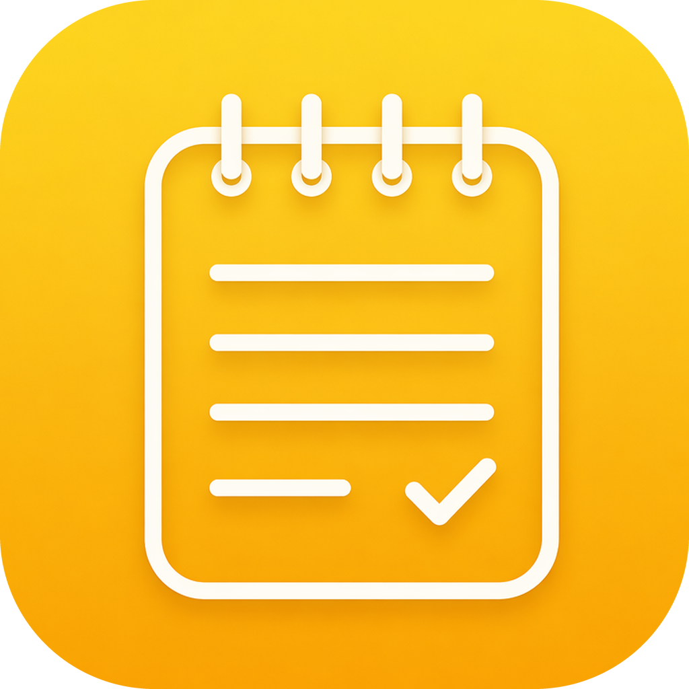

<div align="center">



# 轻记 · Qingji Notes

**一个类似苹果备忘录的桌面笔记应用，为 Windows 打造（同时支持 macOS）**

干净 · 即时保存 · 丝滑 —— 补上 Windows 上一直缺的那款好用备忘录

</div>

---

## ✨ 功能

- 🗂 **三栏布局** —— 文件夹 / 笔记列表 / 编辑器，和苹果备忘录一致
- ✍️ **富文本** —— 标题、大标题、小标题、正文，加粗 / 斜体 / 下划线 / 删除线
- ✅ **可勾选清单** —— 点圆圈即可打勾，todo 一目了然
- 🔢 **项目符号 / 编号列表**
- 🖼 **图片** —— 粘贴、拖拽或点按钮插入（自动压缩大图）
- 🔍 **文件夹分类 · 全文搜索 · 笔记置顶**
- 🏷 **任务状态** —— 右键把备忘录标成「进行中」/「已完成」，列表按权重自动分组排序：置顶 > 进行中 > 已完成 > 默认
- 🗑 **最近删除** —— 删除的笔记先进回收站，30 天内可恢复
- 🌗 **深色模式** —— 手动切换，也可跟随系统
- 🪟 **灵活布局** —— 边栏可一键收起 / 展开，列表与编辑区之间可拖动调整宽度，大屏下编辑区自适应
- 🔄 **局域网同步** —— 同一 WiFi 下多台设备（Windows / Mac）自动互传笔记（文字、图片、清单都同步），数据只在你的设备间直连、不经服务器
- 💾 **自动保存** —— 打字即存，没有「保存」按钮
- 🔒 **纯本地存储** —— 数据存在你自己电脑上，不需要账号、不联网

## 🚀 快速开始

先装好 [Node.js](https://nodejs.org/)（选 LTS 版）。

### 一键脚本（最省事）

双击对应脚本即可，第一次会自动安装依赖：

| 我想做什么 | Windows 双击 | Mac 双击 |
|---|---|---|
| **运行应用** | `启动.bat` | `启动-Mac.command` |
| **拉取最新代码并运行** | `更新并启动.bat` | —— |
| **拉取最新代码并打包安装包** | `更新并打包.bat` | —— |
| **打包成 Windows 安装包** | `打包Windows安装包.bat` | —— |

> 用 `更新并启动.bat` 需要先装 [Git](https://git-scm.com/download/win)，并用 `git clone https://github.com/LB-1996/qingji-notes.git` 把项目拉下来一次；之后每次双击它就会自动拉取最新代码再启动。

> ⚠️ **换电脑传输时，不要拷贝 `node_modules` 文件夹**：它跟操作系统绑定（含各系统专属的二进制和符号链接），跨系统会解压报错、无法启动。只传源码即可，脚本会在新电脑上自动重装依赖；若已误拷，启动脚本也会自动识别并清理重装。

### 命令行

```bash
npm install
npm start          # 运行
npm run build:win  # 在 Windows 上打包出安装包
```

## 📦 打包成 Windows 安装包（.exe）

产物是标准 Windows 安装程序 `dist/轻记 Setup 1.0.0.exe`，双击即可安装。三种方式：

1. **在任意 Windows 电脑上**：双击 `打包Windows安装包.bat`（或 `npm run build:win`）。
2. **用 GitHub Actions 云端打包**（只有 Mac 的人推荐）：推到 GitHub 后，在 **Actions** 里手动运行 **Build Windows Installer**，跑完在 Artifacts 下载。
3. **在 Mac 上交叉打包**：需先 `brew install --cask wine-stable`，再 `npm run build:win`。

## 🎨 换应用图标

把 `logo.ico` 或 `logo.png` 放到项目根目录即可，打包时会自动采用（优先 `.ico`）。建议正方形、至少 256×256。

## 🗂 数据存在哪

- **Windows**：`%APPDATA%\qingji-notes\qingji-notes.json`
- **macOS**：`~/Library/Application Support/qingji-notes/qingji-notes.json`

每次保存前会自动留一份备份，主文件损坏时可回退。

## ⌨️ 快捷键

| 操作 | Windows | macOS |
|---|---|---|
| 新建备忘录 | Ctrl+N | ⌘N |
| 新建文件夹 | Ctrl+Shift+N | ⌘⇧N |
| 搜索 | Ctrl+F | ⌘F |
| 显示 / 隐藏边栏 | Ctrl+\ | ⌘\ |
| 切换深色模式 | Ctrl+Shift+L | ⌘⇧L |

## 🏷 任务状态与排序

在中间列表里**右键**任意备忘录，就能给它设状态（三者单选，当前状态左边打勾）：

| 状态 | 图标 | 排序权重 |
|---|---|---|
| 置顶 | 黄色图钉 | 4（最高） |
| 进行中 | 蓝色半环 | 3 |
| 已完成 | 绿色对勾 | 2 |
| 默认（无状态） | 无 | 1 |

- 列表会按权重**自动分组**：`置顶` → `进行中` → `已完成` → `备忘录`，同组内按修改时间新→旧。
- 置顶是独立开关，和状态可以并存：一条「置顶 + 进行中」的笔记排在置顶组里，但图标仍显示进行中。
- 状态会跟着**局域网同步**一起传到其它设备，两台电脑看到的分组顺序一致。
- 改状态**不会**改动「修改时间」，所以不会因为标一下状态就跳到列表最前面。

## 🔄 局域网同步（多设备互传）

同一局域网（WiFi）下，让多台电脑（Windows / Mac）的笔记自动同步：

1. 每台设备点左下角 **「局域网同步」**
2. 填一个**相同的「同步码」**（自己定，如 `jia-2026`），点 **「开启同步」**
3. 同码的设备会自动发现并连接，之后任意一台的改动（文字、图片、清单）都会**实时同步**到其它台

- 数据只在你的设备之间**直连**，不经过任何外部服务器
- **多台电脑可以同时编辑**：改动会自动双向推送；哪台电脑正停在被改的那条备忘录上、光标就在编辑区里，也照样会更新（正在打字时不打断，停手后自动合并）
- **自动拉取**：刚连上、窗口切回这台电脑、以及每 15 秒，都会自动向其它设备拉一次差异（只传变化的部分，不重传图片）
- **手动拉取**：编辑区右上角的 **⇩** 按钮（或同步弹窗里的「从其它设备拉取最新内容」）可以立刻把别人刚改完的内容取回来
- 某台离线后再上线会**自动补齐**这期间的改动
- 若自动发现失败（部分网络会屏蔽），可在「高级」里手动填对方 `IP:端口`
- 两台**同时**改**同一条**笔记时两份都保留：一份留在原笔记，另一份变成「⚠️ 冲突副本」，不丢数据
- 「以本机为准，强制同步」是同步彻底乱掉时的兜底（会用本机内容覆盖对方），平时用不到
- ⚠️ 首次开启时 Windows 可能弹防火墙提示，请点「允许访问」

## 🛠 技术栈

- **Electron** —— 主/渲染进程隔离，`contextIsolation` 开、`nodeIntegration` 关
- **零前端框架、零运行时依赖** —— 纯 HTML / CSS / 原生 JS，启动快、好维护
- **单 JSON 文件本地存储** —— 原子写入 + 自动备份

## ☕ 请我喝杯咖啡

「轻记」是我用业余时间做的，**永久免费、开源**。如果它帮到了你，或者你觉得好用，欢迎请我喝杯咖啡 —— 这会是我继续维护和改进的最大动力 😄

> 纯自愿，不打赏也完全没关系～ 觉得好用的话，点个 Star ⭐ 或提点建议，我一样开心！

<div align="center">

| 支付宝 | 微信支付 |
|:---:|:---:|
|  |  |

</div>

## 📄 License

[MIT](LICENSE) © 2026 陆宝 —— 可自由使用、修改、分发。
